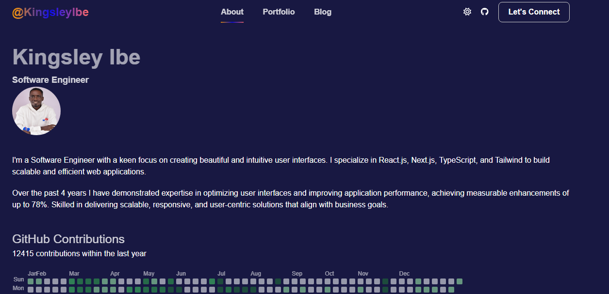

# PERSONAL PORTFOLIO

> This project is to showcase my portfolio to hiring managers and potential clients.

In this project you will find links that would help you learn about me, my recent works,
technologies I used in delivering high performing web application and the Let's Connect button for an email.

I would love to socialize with you also, so I have included my most social media handles.

## Built With

- Tailwind
- SCSS
- Typescript
- Git and GitHub
- React

## Live Demo

[Live Demo Link](https://kingsleyibe.vercel.app/)

## Getting Started

To get a local copy up and running follow these simple example steps.

### Prerequisites
- You should have a basic knowledge of HTML
- You should have a basic knowledge of CSS
- You should have a basic knowledge of JavaScript
- Also, a basic knowledge of git and github
- A code editor: I used VScode for this project but you can use any code editor of your choice
### Setup
- follow steps on this link to set up VScode code editor: [setup vscode](https://www.freecodecamp.org/news/how-to-set-up-vs-code-for-web-development/)

### Install
[download](https://code.visualstudio.com/download) VScode.
[Watch this video](https://www.youtube.com/watch?v=MlIzFUI1QGA) on how to install VScode on windows
## Author

- [GitHub](https://github.com/kingsleyibe)
- [Twitter](https://x.com/kingsleyibec)
- [LinkedIn](https://www.linkedin.com/in/kingsley-ibe/)
- [Medium](https://medium.com/@ibekingsley)
- [Youtube](https://www.youtube.com/@kingsleyibe)

## 🤝 Contributing

Contributions, issues, and feature requests are welcome!

Feel free to check the [issues page](../../issues/).

## Show your support

Give a ⭐️ if you like this project!

## 📝 License

This project is [MIT](./MIT.md) licensed.
# myPortifolioSite
